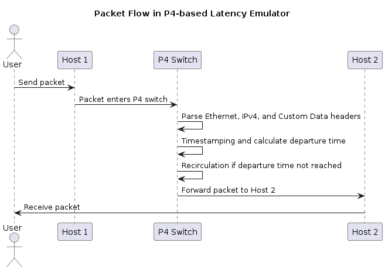
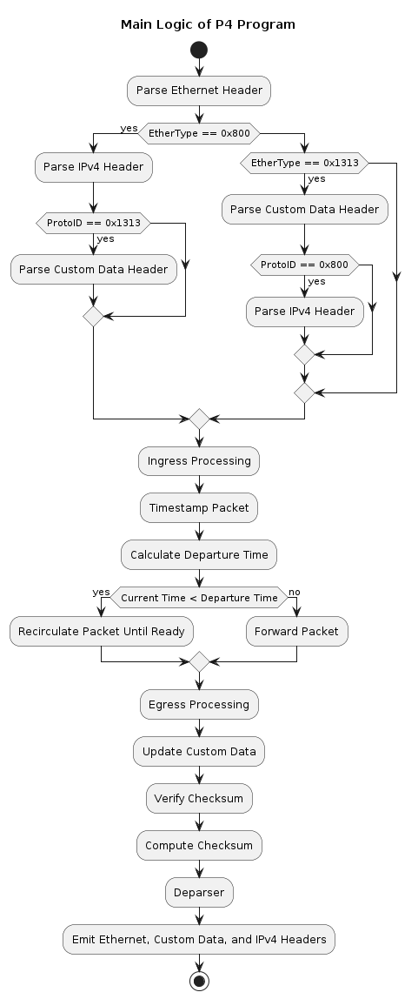
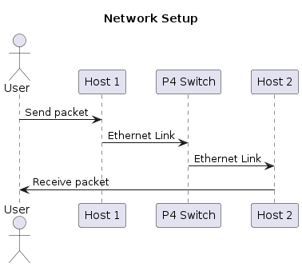
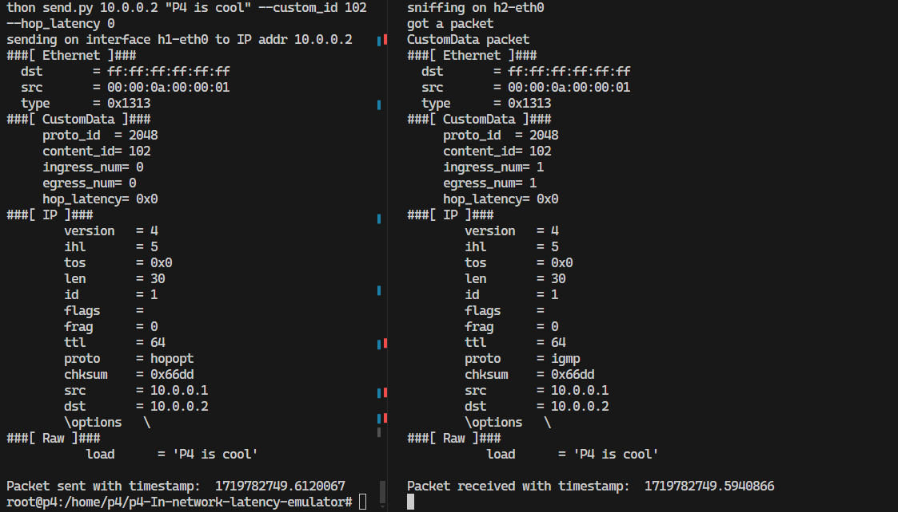
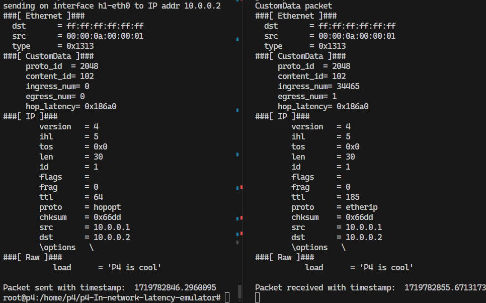

# p4-In-network-latency-emulator

*for the Programmable Networks 2024 course at ELTE*\
*Benedek S. Simon, Jamil Ghazal, Kálmán Neszlényi*

## Open Questions

1. How can we ensure the precision of timestamping for accurate latency emulation?
2. What are the potential limitations of packet recirculation on real switch performance?
3. How can we optimize the latency calculation to handle high traffic loads efficiently?
4. What specific test scenarios will best validate our latency emulation approach in real life?

## Goals

1. Implement a P4-based tool to emulate network latency at the switch level.
2. Provide a practical and accurate mechanism for latency simulation within the data plane.
3. Enable network developers to test and validate applications under various delay conditions.
4. Develop test scripts to generate traffic and measure the accuracy of latency emulation.
5. Evaluate the performance impact of latency emulation on network throughput.

## Plan

1. **Designing the P4 Program** 
   - Define packet metadata to carry hop latency values.
   - Implement timestamping logic to record packet arrival times.
   - Develop recirculation logic to retain packets within the switch until the specified delay is met.
   - Calculate the departure time for each packet based on its hop latency.

2. **Development of Test Scripts** 
   - Create scripts to generate network traffic with varied latency values embedded in packet headers.
   - Develop measurement tools to compare expected and actual departure times.

3. **Testing and Validation** 
   - Set up a Mininet environment with BMv2 switch and virtual hosts.
   - Execute the traffic generation script and observe packet behavior.
   - Validate the accuracy of the latency emulation using the measurement tools.

4. **Performance Evaluation** 
   - Analyze the impact of packet recirculation on the switch's throughput.
   - Evaluate the precision of the implemented latency emulation by comparing the intended and actual departure times of packets.

## Implementation

### Headers Metadata

In our P4-based in-network latency emulator, we have defined several headers and metadata structures that are crucial for the accurate emulation of network latency:

* **ethernet_t Header** : This header contains the standard Ethernet fields such as destination MAC address, source MAC address, and EtherType, which indicates the type of payload carried by the Ethernet frame.

* **ipv4_t Header** : This header holds the standard IPv4 fields, including version, header length, type of service, total length, identification, flags, fragment offset, time to live (TTL), protocol, header checksum, source IP address, and destination IP address.

* **customdata_t Header** : This custom header is specifically designed for our latency emulation purposes. It includes:
  + `proto_id`: Identifies the protocol.
  + `content_id`: Identifies the specific content or flow.
  + `ingress_num`: Tracks the number of times a packet has been processed by the ingress pipeline.
  + `egress_num`: Tracks the number of times a packet has been processed by the egress pipeline.
  + `hop_latency`: Specifies the intended hop latency for the packet in seconds.

* **resubmit_meta_t Metadata** : This structure is used to carry metadata across recirculations of a packet. It includes:
  + `i`: A counter to keep track of the number of recirculations.
  + `arrival_timestamp`: Stores the timestamp of when the packet initially arrived.
  + `departure_timestamp`: Stores the calculated departure timestamp for the packet.

### Switch Logic

 

\
*Figure 1: The P4 Packet Flow*

The main logic of our P4 program involves several key components and processes:

1. **Parsing** :
   - The parser extracts Ethernet, IPv4, and custom data headers from incoming packets.
   - Based on the EtherType, the parser transitions to extract the appropriate headers.

2. **Ingress Processing** :
   - **Timestamping** : On packet arrival, the ingress pipeline timestamps the packet and calculates the expected departure time based on the hop latency.
   - **Recirculation Logic** : If the current time is less than the calculated departure time and the maximum number of recirculations has not been reached, the packet is recirculated.
   - **Forwarding** : If the custom data header is valid, the packet is forwarded according to the custom data forwarding table. If only the IPv4 header is valid, the packet is forwarded based on the IPv4 forwarding table.

3. **Egress Processing** :
   - The egress pipeline updates the custom data with the number the packet went through the egress pipeline .

4. **Checksum Verification and Calculation** :
   - In the checksum verification stage, any necessary checksums are verified.
   - In the checksum computation stage, the IPv4 header checksum is recalculated to ensure data integrity.

5. **Deparsing** :
   - The deparser re-assembles the packet by emitting the Ethernet, custom data, and IPv4 headers in sequence.

6. **Switch Configuration** :
   - The P4 program is configured to run on the BMv2 switch, with specified links, hosts, and a command input file for the switch configuration.

 

\
*Figure 2: The P4 Switch Main Logic*

### Switch and Network Setup

 

\
*Figure 3: The P4 Network Setup*

To emulate network latency, we use Mininet and p4App to create a virtual network environment. The network setup includes the following key components and configurations:

* **P4 Switch** : We add a P4 switch (`s1`) and configure it with the P4 program (`inle.p4 - in network latency emulator`). The switch is also provided with a CLI input file (`s1-commands.txt`) for additional configuration commands.

* **Hosts** : Two hosts (`h1` and `h2`) are added to the network to act as the source and destination for network traffic.

* **Links** : Links are established between the switch and each of the hosts, creating a simple star topology where all traffic passes through the switch.

* **Layer 2 Configuration** : The network is set to operate in Layer 2 (L2) mode, which is appropriate for handling Ethernet frames directly.

* **Logging and Packet Capture** : Packet capture and logging are enabled for all nodes to facilitate debugging and analysis of network traffic and latency.

* **CLI and Network Start** : The command-line interface (CLI) is enabled to allow interactive control and monitoring of the network. Finally, the network is started, making it ready for testing and validation of the latency emulation.

## Example Runs

### 0 hop latency



### 100000 hop latency



### Analysis

During the development and testing of our P4-based in-network latency emulator, we conducted a detailed analysis to evaluate the performance and impact of our implementation. The primary focus was on understanding how packet recirculation affects computational load and overall system performance.

#### Impact of Packet Recirculation on Compute Resources

One of the core mechanisms in our latency emulator is the use of packet recirculation to simulate delays. This involves re-injecting packets back into the switch pipeline multiple times until the intended departure time is reached. While this approach effectively emulates network latency, it has significant implications for compute resource usage:

1. **Increased Computational Load** :
   - **Observation** : Each recirculation of a packet requires additional processing by the switch, leading to increased computational demands.
   - **Impact** : As the number of recirculations increases, the processing burden on the switch's CPU also increases. This results in higher CPU utilization and can lead to performance bottlenecks, especially under high traffic conditions.

2. **Challenges in Virtualized Environments** :
   - **Observation** : Testing the latency emulator in a virtual machine (VM) environment posed particular challenges due to the increased computational load.
   - **Impact** : The limited CPU and memory resources typically allocated to VMs were quickly overwhelmed by the high processing demands of packet recirculations. This resulted in slower performance and made it harder to measure the latency of the delayed packets.

3. **Performance Degradation** :
   - **Observation** : With extensive recirculations, the overall throughput of the switch decreased, and packet processing delays increased.
   - **Impact** : This performance degradation was especially noticeable in scenarios with high traffic volumes, where the switch struggled to keep up with the processing requirements. The increased latency and reduced throughput hindered the ability to accurately test and validate latency-sensitive applications.

### How to Run and Test Scripts

To run and test the P4-based in-network latency emulator, follow these steps:

1. **Start the P4 Environment** :
   - Use the `p4run` command to set up the P4 environment, including starting the Mininet network with the specified P4 program and topology.
   

```sh
sudo p4run
```

2. **Open Terminal for Host h1** :
   - In Mininet, open a terminal for host `h1` .
   

```sh
mx h1
```

3. **Send Packets from Host h1** :
   - Use the following commands to send packets with and without custom data headers from `h1` to `h2` .

   - Send a packet with custom data:

     

```sh
python send.py 10.0.0.2 "P4 is cool" --custom_id 102 --hop_latency 100
```

   - Send a standard TCP packet:

     

```sh
python send.py 10.0.0.2 "P4 is cool"
```

   - Send multiple packets with varying hop latencies:

     

```sh
python traffic_gen.py 10.0.0.2 "P4 is cool" --custom_id 102 3 1000 2000 3000
```

4. **Open Terminal for Host h2** :
   - In Mininet, open a terminal for host `h2` to receive and

 validate the packets.
   

```sh
mx h2
```

5. **Run the Receive Script on Host h2** :
   - Use the following command to start sniffing for incoming packets and print their details:
   

```sh
python receive.py
```

### Other Potential Implementation Methods

In addition to our current P4-based in-network latency emulator, there are several other high-level ideas that can be implemented within the P4 framework to further enhance the functionality and performance of network latency emulation. These ideas are practical and can be explored as future works:

1. **Dynamic Latency Adjustment Based on Network Conditions** :
   - **Description** : Implementing logic to dynamically adjust latency values based on real-time network conditions such as congestion levels and traffic patterns.
   - **Advantages** :

     - Provides adaptive latency emulation that responds to changing network states.
     - Helps in testing applications under varying latency scenarios.

   - **Implementation** :

     - Use P4 to monitor network metrics.
     - Adjust latency values in packet headers dynamically based on observed conditions.

2. **Per-Flow Latency Emulation** :
   - **Description** : Emulating latency on a per-flow basis to provide different delay characteristics for different types of traffic.
   - **Advantages** :

     - Allows for more granular control of latency emulation.
     - Facilitates testing of Quality of Service (QoS) policies.

   - **Implementation** :

     - Use P4 tables to identify and classify different flows.
     - Apply different latency values to each flow based on predefined criteria.

3. **Latency Emulation with Queueing Delays** :
   - **Description** : Incorporating queueing delay emulation to simulate the impact of packet queueing in network devices.
   - **Advantages** :

     - More realistic latency emulation by accounting for delays due to queueing.
     - Useful for testing applications sensitive to jitter and bufferbloat.

   - **Implementation** :

     - Implement P4 logic to introduce queueing delays based on packet arrival rates and queue lengths.
     - Adjust departure times accordingly.

4. **Timestamp Synchronization Across Multiple Switches** :
   - **Description** : Synchronizing timestamps across multiple P4 switches to ensure consistent latency emulation in multi-switch environments.
   - **Advantages** :

     - Enables accurate latency emulation in larger, more complex network topologies.
     - Facilitates end-to-end latency measurement and control.

   - **Implementation** :

     - Use P4 to implement protocols for timestamp synchronization between switches.
     - Ensure that all switches in the network have a consistent view of time.

## References

1. Fernandez, C. (n.d.).*P4 Tutorials: Recirculate Exercise Solution*. Retrieved from [GitHub](https://github.com/CarolinaFernandez/p4-tutorials/blob/master/exercises/recirculate/solution/recirculate.p4)

2. Google Search. (n.d.).*P4app*. Retrieved from [Google](https://www.google.com/search?q=p4app&oq=p4app&gs_lcrp=EgZjaHJvbWUyBggAEEUYOTIICAEQABgPGB4yCAgCEAAYBRgeMgoIAxAAGIAEGKIEMgoIBBAAGIAEGKIEMgoIBRAAGIAEGKIEMgYIBhBFGDwyBggHEEUYPDIGCAgQRRg80gEHODQ2ajBqMagCALACAA&sourceid=chrome&ie=UTF-8)

3. Slaki, S. (n.d.).*Prognets 2024*. Retrieved from [GitHub](https://github.com/slaki/prognets2024)

4. ETH Zurich. (2022).*Advanced Networks 2022 Exercises*. Retrieved from [GitLab](https://gitlab.ethz.ch/nsg/public/adv-net-2022-exercises/-/tree/main)

5. Fingerhut, J. A. (n.d.).*P4 Guide: v1model Special Operations*. Retrieved from [GitHub](https://github.com/jafingerhut/p4-guide/blob/master/v1model-special-ops/README.md)
